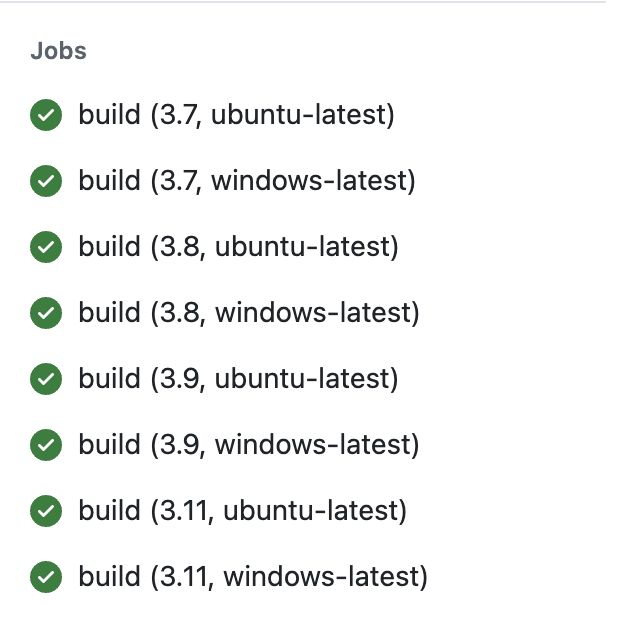
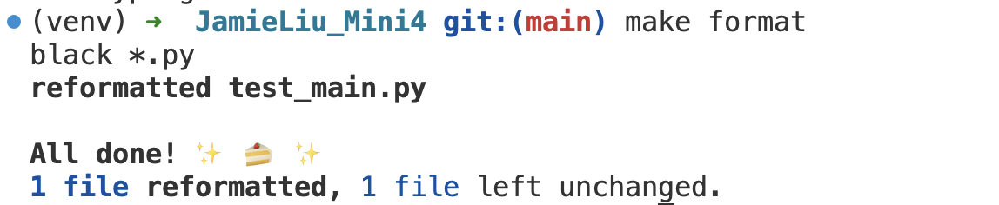
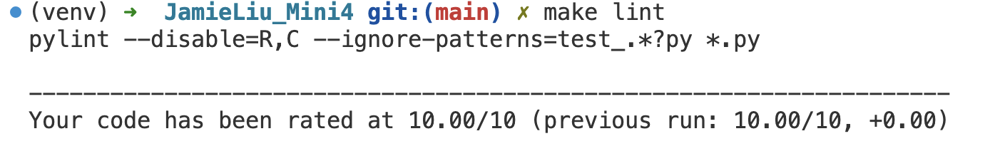
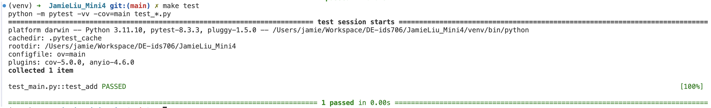

# JamieLiu_Mini4

[](https://github.com/nogibjj/JamieLiu_Mini4/actions/workflows/ci.yml)

## Purpose

- Set up a GitHub Actions workflow
- Test across at least 3 different Python versions

## Features

- `.devcontainer` configuration for a consistent Python development environment using Docker.
- **Makefile** to streamline common tasks like install, format, lint, test.
- **GitHub Actions** for automated CI/CD pipeline.
- `requirements.txt` for managing Python dependencies.

## Github actions with matrix strategy



## Usage

1. **Clone the repository:**
   ```bash
   git clone git@github.com:nogibjj/JamieLiu_Mini4.git
   ```
2. **Install project dependencies:**
   ```bash
   make install
   ```
3. **Format the code:**

   ```bash
   make format
   ```

   

4. **Run linting checks:**

   ```bash
   make lint
   ```

   

5. **Run tests:**

   ```bash
   make test
   ```

   

6. **Run all steps (Install, Format, Lint, Test):**
   ```bash
   make all
   ```
